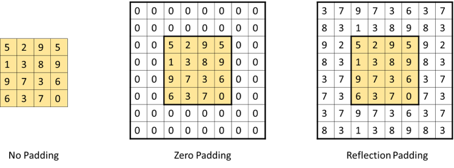
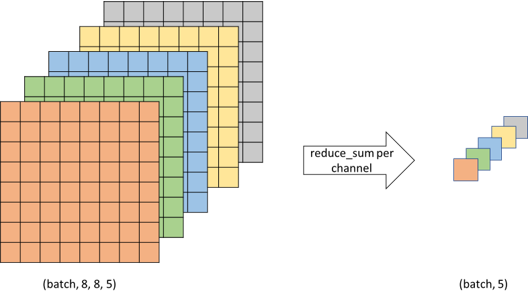

# DeepSaki.layers

## ReflectionPadding
At the time of implementation, Google's TPU does not support gradient calculation of mirrored paddings like "SYMMETRIC" and "REFLECTION" Therefore, a custom gradient needs to be defined, by cropping the padding and passing the gradients from the previous layer.

## GlobalSumPooling2D

